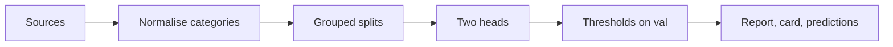
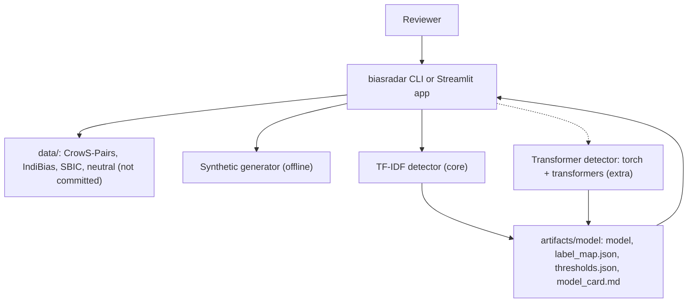
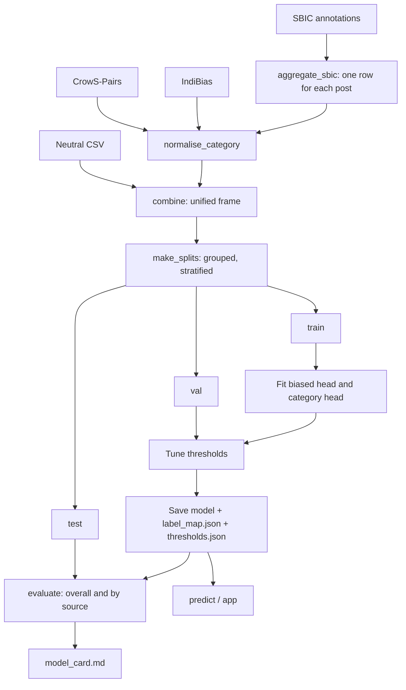

<div align="center">

# biasradar — Social-Bias Detection with a Saved Label Map and Two Honest Heads

**biasradar is a text classifier for researchers and reviewers who look for social-bias generalisations. It takes benchmark and post data through these steps to a scored text with categories:**

`load sources` → `normalise categories` → `split by group` → `train two heads` → `tune thresholds` → `evaluate by source` → `predict`.


**[Summary](#1-summary)** ·
**[Workflow](#4-the-end-to-end-workflow)** ·
**[Run it](#14-how-to-run-biasradar)** ·
**[Configuration](#144-environment-variables)** ·
**[Known problems](#17-known-problems)** ·
**[Glossary](#19-glossary)**

</div>

> [!NOTE]
> This README uses ASD-STE100 Simplified Technical English. The writing rules and the project
> vocabulary are in [`docs/ste-style-guide.md`](docs/ste-style-guide.md). Each term in the
> [Glossary](#19-glossary) has only one meaning.

> [!WARNING]
> Do not use biasradar as an automatic moderation or hiring decision. A person must review each result.
> The training sources contain offensive sentences, and their annotators and topics have their own biases.

---

biasradar gives each text two kinds of output: `p(biased)` and one independent probability for each of 10 social-bias categories.
The scores do not have to sum to 1, so a neutral text can be low in every category.
All sources go through one taxonomy, and the label map is saved with each model.
The splits keep each benchmark pair or post in one part, and the evaluation reports each category and each source.

This README is the **one location that explains all of biasradar**. It gives these topics:

- the general design
- each component and its procedure, step by step
- the decision rules
- the data map
- the runbook
- the validation results and the known problems

| If you are… | Read |
|---|---|
| A manager or reviewer | [1](#1-summary), [3](#3-design-rules), [4](#4-the-end-to-end-workflow), [16](#16-validation-results), [18](#18-key-points) |
| A developer who joins the project | All sections, in sequence. Keep [14](#14-how-to-run-biasradar) and [17](#17-known-problems) open while you work |
| An operator who runs biasradar | [14](#14-how-to-run-biasradar), then the section for the component that you use |

---

## Table of contents

1. 🧭 [Summary](#1-summary)
2. 🏗️ [How biasradar is built](#2-how-biasradar-is-built)
   - 2.1 [Components](#21-components)
   - 2.2 [System context](#22-system-context)
   - 2.3 [Repository layout](#23-repository-layout)
3. 🛡️ [Design rules](#3-design-rules)
4. 🔄 [The end-to-end workflow](#4-the-end-to-end-workflow)
   - 4.1 [Full flow](#41-full-flow)
   - 4.2 [The life cycle of one text](#42-the-life-cycle-of-one-text)
5. 🔵 [The taxonomy and the label map](#5-the-taxonomy-and-the-label-map)
6. 🟢 [The source loaders](#6-the-source-loaders)
7. 🟣 [The grouped splits](#7-the-grouped-splits)
8. 🧮 [The TF-IDF detector](#8-the-tf-idf-detector)
9. 🧠 [The transformer detector](#9-the-transformer-detector)
10. 📏 [Evaluation and thresholds](#10-evaluation-and-thresholds)
11. 🔍 [Explanations, the model card and the app](#11-explanations-the-model-card-and-the-app)
12. 🖥️ [The CLI](#12-the-cli)
13. 🗂️ [Data and file map](#13-data-and-file-map)
14. ▶️ [How to run biasradar](#14-how-to-run-biasradar)
    - 14.1 [Prerequisites](#141-prerequisites) · 14.2 [Installation](#142-installation) · 14.3 [Run biasradar](#143-run-biasradar) · 14.4 [Environment variables](#144-environment-variables)
15. 🧩 [How to extend biasradar](#15-how-to-extend-biasradar)
16. ✅ [Validation results](#16-validation-results)
17. ⚠️ [Known problems](#17-known-problems)
18. 📌 [Key points](#18-key-points)
19. 📖 [Glossary](#19-glossary)
20. 📄 [License](#20-license)

---

## 1. Summary

**The problem.** A reviewer wants to know if a text generalises about a social group, and about which group. These questions are difficult:

- How do you show the correct category name for each output?
- How do you combine sources that spell the same category in two ways?
- How can the detector say "no bias" when the benchmarks contain only biased sentences?
- Which categories and which sources does the model handle well?

biasradar gives each of these questions its own component. Each component has tests that prove its rule.

| Item | Value |
|---|---|
| Input | CrowS-Pairs, IndiBias, SBIC and neutral CSV files, or SYNTHETIC data |
| Output | `p(biased)`, 10 category probabilities, flags at tuned thresholds, a test report and a model card |
| Components | **12** modules: taxonomy, sources, synthetic, splits, metrics, model, transformer, evaluate, explain, card, config, cli, plus the Streamlit app |
| Models | `tfidf` (core, scikit-learn) and `transformer` (extra `hf`, default encoder `microsoft/deberta-v3-base`) |
| Offline mode | The TF-IDF detector, the demo and all core tests. No key, no download |
| Safety | Independent sigmoid outputs, a saved label map, a disclaimer in each CLI and app output |
| Tests | **28** unit tests (`pytest`). CI installs only `.[dev]`: **26** pass and **2** skip (`hf` extra). With the `hf` extra: 28 pass |



---

## 2. How biasradar is built

### 2.1 Components

| Component | Module | Purpose |
|---|---|---|
| Taxonomy | `src/biasradar/taxonomy.py` | 10 categories, aliases, SBIC map, `LabelMap` |
| Source loaders | `src/biasradar/sources.py` | CrowS-Pairs, IndiBias, SBIC aggregation, neutral text, unified frame |
| Synthetic data | `src/biasradar/synthetic.py` | Template corpus with 4 % label noise |
| Splits | `src/biasradar/splits.py` | Grouped, stratified train / val / test, coverage table |
| Metrics | `src/biasradar/metrics.py` | Per-category P/R/F1/PR-AUC, biased head metrics, threshold tuning |
| TF-IDF detector | `src/biasradar/model.py` | Word and character TF-IDF, two logistic-regression heads |
| Transformer detector | `src/biasradar/transformer.py` | Encoder plus two heads, masked BCE with logits (torch) |
| Evaluation | `src/biasradar/evaluate.py` | Overall, per-source and worst-error report |
| Explanations | `src/biasradar/explain.py` | Prediction formatter, top n-grams, disclaimer |
| Model card | `src/biasradar/card.py` | `model_card.md` from the test report |
| Settings | `src/biasradar/config.py` | Environment variables and a local `.env` loader |
| CLI | `src/biasradar/cli.py` | The `biasradar` command with 7 subcommands |
| App | `src/biasradar/app/streamlit_app.py` | Cached model, label map from the artefact |

### 2.2 System context



### 2.3 Repository layout

```
biasradar/
├── .github/workflows/ci.yml     # CI: Python 3.11, pip install -e ".[dev]", pytest -q
├── .env.example                 # the 5 environment variable names, no values
├── pyproject.toml               # core deps, extras hf, app, dev, biasradar script
├── data/README.md               # sources, licenses, columns, prepare command
├── docs/ste-style-guide.md      # writing rules and project vocabulary
├── src/biasradar/
│   ├── taxonomy.py  sources.py  synthetic.py  splits.py
│   ├── model.py  transformer.py  metrics.py  evaluate.py
│   ├── explain.py  card.py  config.py  cli.py
│   └── app/streamlit_app.py
└── tests/                       # 28 tests, synthetic data only
```

---

## 3. Design rules

### 3.1 The label map travels with the model
`LabelMap` is saved as `label_map.json` next to each model. `load_model` reads it, and the CLI and the app print category names only from it.

### 3.2 One spelling for each category
`normalise_category` lowercases each name and applies the alias table. `Religion` (IndiBias) and `religion` (CrowS-Pairs) become one category. An unknown name raises `UnknownCategory`.

### 3.3 Logits go to the loss
The transformer heads return logits. `masked_losses` uses `binary_cross_entropy_with_logits`, so no activation is applied two times. The predictions use `sigmoid` only at inference.

### 3.4 The detector can say "no bias"
`p(biased)` is a separate head, and the category probabilities are independent. Neutral rows train both heads as negatives. If the training data has only one class, the report says that the biased head is not trained.

### 3.5 Unknown labels are masked, not guessed
An anti-stereotype row has no `is_biased` value, so it trains only the category head. An SBIC post that is biased but has no mapped category does not train the category head.

### 3.6 Splits keep groups and sources balanced
`make_splits` uses `StratifiedGroupKFold` on (source, biased flag, first category). Each group stays in one split, and `coverage` shows the rows of each category in each split.

### 3.7 Problems of the earlier prototype and their fixes

| # | Problem in the earlier prototype | Fix in biasradar | Test |
|---|---|---|---|
| 1 | The app printed 5 of 11 categories under the wrong name | Saved label map, names only from the artefact | `test_saved_label_map_drives_the_names` |
| 2 | `Religion` and `religion` were two classes | `normalise_category` with aliases | `test_religion_spellings_become_one_category` |
| 3 | Softmax output with a from-logits loss | Logits plus `BCEWithLogitsLoss` | `test_masked_losses_use_logits` |
| 4 | No "not biased" output, softmax always sums to 1 | Separate biased head, independent sigmoid categories, neutral rows | `test_scores_are_independent_and_neutral_text_scores_low` |
| 5 | Positional split, so some classes never in validation or test | Grouped stratified splits and a coverage table | `test_splits_keep_groups_and_cover_categories` |
| 6 | SBIC `dropna` on all columns kept about 1 % of rows | Keep needed columns first, aggregate annotations for each post | `test_sbic_aggregation_keeps_posts_without_target` |
| 7 | Stage 1 head thrown away with no measured gain | One multi-task model. No unmeasured stage | `test_tiny_transformer_trains_saves_and_loads` |
| 8 | Accuracy only, on 200 rows | Per-category P/R/F1/PR-AUC, ROC-AUC, ECE, false alarms, per-source metrics | `test_evaluation_report` |
| 9 | Weights in Git, missing requirements, no app cache | No weights in Git, complete extras, `st.cache_resource` | `test_cli_round_trip` |

---

## 4. The end-to-end workflow

### 4.1 Full flow



### 4.2 The life cycle of one text

1. The CLI or the app loads the model folder once.
2. The detector changes the text into features (TF-IDF) or tokens (transformer, maximum 128).
3. The biased head gives `p(biased)`. The category head gives 10 independent probabilities.
4. Each probability is compared with its saved threshold.
5. The output lists `p(biased)`, the flag, and the categories sorted by probability, with names from `label_map.json`.
6. The output ends with the disclaimer.

---

## 5. The taxonomy and the label map

**Purpose.** Give each source the same 10 categories with one spelling.

| Category | Typical source |
|---|---|
| `age`, `disability`, `gender`, `physical-appearance`, `socioeconomic` | CrowS-Pairs and IndiBias |
| `nationality`, `race-color`, `sexual-orientation` | CrowS-Pairs |
| `religion` | CrowS-Pairs (`religion`) and IndiBias (`Religion`) |
| `caste` | IndiBias (`Caste`) |

| SBIC `targetCategory` | biasradar category |
|---|---|
| `race` | `race-color` |
| `gender` | `gender` |
| `disabled` | `disability` |
| `body` | `physical-appearance` |
| `culture`, `social`, `victim` | none (these mix several categories) |

**Rules**

- `LabelMap.load` refuses a file with a repeated category.
- The taxonomy version (`1.0`) is saved in `label_map.json`.

---

## 6. The source loaders

**Purpose.** Change each source into the unified frame.

| Column | Meaning |
|---|---|
| `text` | The sentence or post |
| `source` | `crows`, `indibias`, `sbic`, `neutral`, `synth_a` or `synth_b` |
| `group_id` | Rows with the same id stay in one split |
| `is_biased` | 1, 0 or empty (unknown) |
| `categories` | `;`-joined category names, or empty |
| `polarity` | `stereo`, `antistereo`, `offensive` or `neutral` |

**Procedure (SBIC)**

1. Keep only `post`, `offensiveYN` and `targetCategory`. Drop rows without a post.
2. Group the annotation rows by post.
3. Set `is_biased` to 1 if the mean `offensiveYN` is 0.5 or more, else 0.
4. For a biased post, keep each mapped category that `min_votes` (default 1) or more annotators named.

**Rules**

- A stereotype row has `is_biased = 1`. An anti-stereotype row has an empty `is_biased`.
- `combine` drops empty texts and exact duplicate texts inside one source.

---

## 7. The grouped splits

**Purpose.** Score each category and each source on rows that the model did not see.

**Procedure**

1. Make a stratum for each row: source, biased flag (`b`, `n` or `u`) and first category.
2. Merge each stratum with fewer than 10 rows into a `<source>|rare` stratum.
3. Take the test part (15 %) with `StratifiedGroupKFold` by `group_id`.
4. Take the validation part (15 % of all rows) from the rest in the same way.
5. Check that no group is in two splits.

**Rules**

- `coverage` gives the rows of each category in each split. `prepare` warns if a category has no test rows.

---

## 8. The TF-IDF detector

**Purpose.** Give a fast, offline detector with the same outputs as the transformer.

| Part | Setting |
|---|---|
| Word features | `TfidfVectorizer`, 1–2 grams, sublinear TF |
| Character features | `TfidfVectorizer(analyzer="char_wb")`, 3–5 grams, `min_df=2` |
| Biased head | `LogisticRegression(C=4, class_weight="balanced")` on rows with a known `is_biased` |
| Category head | One `LogisticRegression` for each category, on rows with known categories |

**Rules**

- A category with no positive rows in training gives a constant probability.
- If the training rows have only one biased class, the biased head stores a constant, and `biased_head_trained` is false.

---

## 9. The transformer detector

**Purpose.** Give a stronger detector with the same interface (`pip install biasradar[hf]`).

**Procedure**

1. Load the tokenizer and the encoder (`BIASRADAR_ENCODER`, default `microsoft/deberta-v3-base`).
2. Put two linear heads on the first token: 1 logit for biased, 10 logits for the categories.
3. For each batch, calculate the masked BCE-with-logits loss of each head. Add the two losses.
4. Use `pos_weight` = negatives / positives for each category, at most 50.
5. Train with AdamW (learning rate 2e-5, weight decay 0.01), batch 16, 3 epochs, seed 42.
6. After each epoch, measure the validation macro F1. Save `best.pt` at each new best.
7. Load `best.pt` again, then tune the thresholds on validation.
8. Save the encoder, the tokenizer, `heads.pt`, `label_map.json` and `thresholds.json`.

---

## 10. Evaluation and thresholds

**Purpose.** Show which categories and which sources work.

| Metric | Head | Note |
|---|---|---|
| Precision, recall, F1, support | Each category | At the tuned threshold |
| PR-AUC | Each category, biased | From probabilities |
| ROC-AUC | Biased | Rows with a known `is_biased` |
| ECE | Biased | 10 bins |
| Neutral false-alarm rate | Biased | Share of neutral rows that are flagged |
| Micro and macro F1 | Categories | Macro over the categories present |
| By source | Both | The same metrics for each source |
| Worst errors | Biased | The 10 rows with the largest error |

**Rules**

- The thresholds come from the validation split only, on a grid from 0.05 to 0.95.
- Among thresholds with the same F1, the code selects the one nearest to 0.5.
- A category with no validation rows keeps the threshold 0.5.

---

## 11. Explanations, the model card and the app

| Part | What it does |
|---|---|
| `predict_text` | `p(biased)`, the flag, and each category with its probability and flag |
| `top_terms` | TF-IDF only: the n-grams with the largest positive effect on the biased logit |
| `format_prediction` | Text output with the note that the category scores do not sum to 1 |
| `write_card` | `model_card.md`: date, sources (marked SYNTHETIC when synthetic), test metrics, limits |
| Streamlit app | `st.cache_resource` loads the model once. The page shows the disclaimer, the scores and the top terms |

---

## 12. The CLI

| Command | What it does |
|---|---|
| `biasradar synth [--out F] [--seed S]` | Write a SYNTHETIC unified file with splits |
| `biasradar prepare [--crows F] [--indibias F] [--sbic F...] [--neutral F] [--out F]` | Load, normalise, combine and split real sources |
| `biasradar train --data F [--model tfidf\|transformer] [--encoder ID] [--epochs N] [--out D]` | Train, tune, evaluate on test, save model, report and card |
| `biasradar evaluate --data F [--model-dir D] [--split S] [--json]` | Evaluate a saved model on one split |
| `biasradar predict TEXT... [--model-dir D] [--explain]` | Score texts |
| `biasradar app [STREAMLIT ARGS]` | Start the Streamlit app (extra `app`) |
| `biasradar demo` | Offline demo on SYNTHETIC data |

**Rules**

- A `ConfigError`, `SourceError`, `UnknownCategory`, `FileNotFoundError`, `KeyError`, `ValueError` or `ImportError` prints `error: <message>`, and the exit code is 1.
- `predict` always ends with the disclaimer.

---

## 13. Data and file map

| Path | Committed? | Contents |
|---|---|---|
| `data/README.md` | Yes | Sources, licenses, columns, prepare command |
| `data/*.csv`, `data/SBIC/` | No (git ignores them) | Downloaded sources and the unified file |
| `artifacts/model/model.joblib` or `encoder/` + `heads.pt` | No (git ignores them) | Saved detector |
| `artifacts/model/label_map.json`, `thresholds.json`, `test_report.json`, `model_card.md` | No (git ignores them) | Saved with each model |
| `.env.example` | Yes | 5 variable names, no values |

---

## 14. How to run biasradar

### 14.1 Prerequisites

| Need | For |
|---|---|
| Python 3.11+ | All components |
| `numpy`, `pandas`, `scikit-learn`, `joblib` | The core (installed with the package) |
| Extra `hf` (`torch`, `transformers`) | The transformer detector |
| Extra `app` (`streamlit`) | The app |
| A GPU | Practical transformer training on SBIC |

### 14.2 Installation

```bash
git clone https://github.com/KrishnaAnnavaram/biasradar.git
cd biasradar
python -m venv .venv
. .venv/bin/activate            # Windows: .venv\Scripts\activate
pip install -e ".[dev]"
pip install -e ".[hf,app]"      # optional
```

### 14.3 Run biasradar

Offline:

```bash
biasradar demo
biasradar synth --out data/synthetic.csv
biasradar train --data data/synthetic.csv --out artifacts/model
biasradar predict "All old people are bad with money." --explain
biasradar app
```

With real sources (see [`data/README.md`](data/README.md)):

```bash
biasradar prepare --crows data/crows_pairs.csv --indibias data/IndiBias_v1_sample.csv \
    --sbic data/SBIC/SBIC.v2.trn.csv data/SBIC/SBIC.v2.dev.csv data/SBIC/SBIC.v2.tst.csv --out data/unified.csv
biasradar train --data data/unified.csv --model tfidf --out artifacts/tfidf
biasradar train --data data/unified.csv --model transformer --out artifacts/deberta
biasradar evaluate --data data/unified.csv --model-dir artifacts/deberta --split test
```

### 14.4 Environment variables

| Variable | Used by | Meaning |
|---|---|---|
| `BIASRADAR_DATA_DIR` | Settings | Data folder. Default `data` |
| `BIASRADAR_MODEL_DIR` | `train`, `evaluate`, `predict`, app | Model folder. Default `artifacts/model` |
| `BIASRADAR_SEED` | Splits, models | Seed. Default 42 |
| `BIASRADAR_ENCODER` | Transformer | Hugging Face encoder id. Default `microsoft/deberta-v3-base` |
| `HF_HOME` | transformers | Cache folder for downloaded weights |

biasradar uses no credentials. Keep local settings in `.env`. Git ignores this file.

---

## 15. How to extend biasradar

| You want to… | Do this | Code change? |
|---|---|---|
| Add a source (for example StereoSet) | Write a loader that returns the unified columns | Small |
| Add a category spelling | Add it to `ALIASES` in `taxonomy.py` | Small |
| Add a category | Add it to `CATEGORIES` and increase `TAXONOMY_VERSION`. Retrain | Small |
| Use another encoder | `--encoder roberta-base` | No |
| Change the SBIC vote rule | Pass `min_votes` to `aggregate_sbic` | Small |

Planned milestones (not built):

- **M6:** token attributions (integrated gradients) for the transformer detector.
- **M7:** temperature scaling for the biased head.
- **M8:** a fairness check of the detector itself: false alarms for each mentioned group.

---

## 16. Validation results

| Validation | Result | Command |
|---|---|---|
| Unit tests (CI installs only `.[dev]`) | **26 passed, 2 skipped** (the 2 transformer tests) | `pytest -q` |
| Unit tests with the `hf` extra | **28 passed** | `pytest -q` |

**SYNTHETIC demo** (835 rows: train 596, val 119, test 120, TF-IDF detector):

| Metric (test) | Value |
|---|---|
| Biased head ROC-AUC / PR-AUC | 0.916 / 0.952 |
| Biased head F1 at threshold 0.40 | 0.976 |
| Neutral false-alarm rate | 0.111 |
| Biased head ECE | 0.057 |
| Category micro F1 / macro F1 | 0.990 / 0.987 |

The synthetic sentences come from templates, so the category scores are almost perfect. They prove that the pipeline works, not that the detector works on real text.

**Local run on the real CrowS-Pairs and IndiBias sample files** (2,067 rows: train 1,475, val 296, test 296, TF-IDF detector). CI does not reproduce this run, because the data is not in the repository.

| Category (test) | Support | F1 | PR-AUC |
|---|---|---|---|
| `age` | 23 | 0.714 | 0.802 |
| `caste` | 8 | 0.941 | 1.000 |
| `disability` | 14 | 0.833 | 0.858 |
| `gender` | 71 | 0.824 | 0.923 |
| `nationality` | 22 | 0.511 | 0.592 |
| `physical-appearance` | 13 | 0.750 | 0.682 |
| `race-color` | 75 | 0.803 | 0.850 |
| `religion` | 28 | 0.885 | 0.910 |
| `sexual-orientation` | 12 | 0.957 | 0.951 |
| `socioeconomic` | 30 | 0.847 | 0.912 |
| **Micro / macro F1** | 296 | **0.799 / 0.807** | |

| Source (test) | Category macro F1 |
|---|---|
| CrowS-Pairs (216 rows) | 0.771 |
| IndiBias (80 rows) | 0.862 |

These two benchmarks contain no neutral rows, so the biased head was not trained in this run. The report says so. Add SBIC or a neutral file to train it.

---

## 17. Known problems

Read these problems before you use biasradar results.

| # | Area | Problem | Impact and action |
|---|---|---|---|
| 1 | Real results | No transformer run and no SBIC run are in this repository | Download the sources and run `train` |
| 2 | Biased head | CrowS-Pairs and IndiBias have only biased rows | Add SBIC or a neutral file, or the biased head is not trained |
| 3 | Use | The detector is not a moderation, hiring or legal decision | A person must review each result |
| 4 | Data bias | The benchmarks are crowd-written, mostly US and Indian contexts, in English | Do not expect the same scores on other text |
| 5 | Taxonomy | SBIC `culture`, `social` and `victim` have no category | These posts train only the biased head |
| 6 | Nationality | The real-data F1 for `nationality` is 0.511 | Read the per-category table before you trust a flag |
| 7 | Synthetic data | Template sentences make the synthetic scores too high | Use synthetic numbers only as a pipeline check |
| 8 | Explanations | `top_terms` works for the TF-IDF detector only | Token attributions are planned (M6) |
| 9 | CI | CI does not run the 2 transformer tests | Run `pytest` with the `hf` extra before a release |

---

## 18. Key points

1. **Category names come from the saved label map.** The app and the CLI cannot show a wrong name.
2. **One category has one spelling.** `Religion` and `religion` are the same category.
3. **The heads give independent probabilities.** A neutral text can be low in every category.
4. **Unknown labels are masked.** Anti-stereotype rows train only the category head.
5. **The evaluation is per category and per source.** On real data, `nationality` is the weakest category.
6. **The detector supports human review only.**

---

## 19. Glossary

| Term | Meaning |
|---|---|
| **Anti-stereotype row** | A benchmark sentence with `antistereo` polarity. It trains only the category head |
| **Biased head** | The output `p(biased)` |
| **Category** | One of the 10 social-bias categories in the label map |
| **Category head** | The 10 independent category probabilities |
| **False alarm** | A neutral row that the biased head flags |
| **Group** | Rows with one `group_id`. A group stays in one split |
| **Label map** | The saved list of categories in `label_map.json` |
| **Model card** | The `model_card.md` file next to a saved model |
| **Neutral row** | A row with `is_biased = 0` |
| **Source** | The data set that a row comes from |
| **Split** | `train`, `val` or `test` |
| **Stereotype row** | A benchmark sentence with `stereo` polarity |
| **Synthetic data** | Data that `synthetic.py` makes |
| **Threshold** | The probability above which a head flags a text |

---

## 20. License

[MIT](LICENSE) © 2026 Krishna Annavaram
